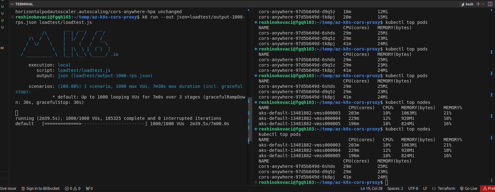

# Azure Kubernetes CORS Proxy

## Overview

This project sets up a scalable and highly available CORS proxy service on an Azure Kubernetes Service (AKS) cluster using Terraform for Infrastructure as Code (IaC). The CORS proxy handles HTTP requests, adds appropriate CORS headers, and forwards them to the target server.

## Repository Structure

```
az-k8s-cors-proxy/
├── k8s
│   ├── cors-proxy.yml
│   ├── hpa.yml
│   └── metrics-server-deployment.yml
├── loadtest
│   └── loadtest.js
├── README.md
└── terraform
    ├── main.tf
    ├── outputs.tf
    ├── provider.tf
    └── variables.tf

```     
# Steps and Requirements
1. Cloud Provider Setup

    Provider: Azure

    Account: Created a dev account on Azure for the challenge.

2. Kubernetes Cluster

    Cluster: Set up a Kubernetes cluster using Azure Kubernetes Service (AKS).
    Configuration: The cluster is configured for high availability and can scale based on load.

3. Infrastructure as Code (IaC)

    Tool: Terraform
    IaC Scripts:
        terraform/main.tf: Main configuration file for setting up the infrastructure.
        terraform/variables.tf: Variables used in the configuration.
        terraform/outputs.tf: Outputs of the Terraform deployment.
        terraform/provider.tf: Configuration for the Azure provider.

Instructions for Using IaC Scripts

# Initialize Terraform:

```
terraform init
```   
Plan the Deployment:

```   
terraform plan
```   
Apply the Deployment:

```   
terraform apply
```   
4. Application

    Service: Deployed a CORS proxy using the redocly/cors-anywhere Docker image.
    Deployment Configuration:
        File: k8s/cors-proxy.yml
        The service handles HTTP requests, adds CORS headers, and forwards them.

5. Scalability

    Configuration: Configured Kubernetes Horizontal Pod Autoscaler (HPA) and Metrics Server to scale the CORS proxy service based on CPU/memory usage or request count.
    HPA Configuration File: k8s/hpa.yml
    Metrics Server Deployment File: k8s/metrics-server-deployment.yml
    Request Handling: Ensured that the service can handle up to 1000 requests per second.

6. Load Testing

```   

          /\      |‾‾| /‾‾/   /‾‾/   
     /\  /  \     |  |/  /   /  /    
    /  \/    \    |     (   /   ‾‾\  
   /          \   |  |\  \ |  (‾)  | 
  / __________ \  |__| \__\ \_____/ .io

     execution: local
        script: loadtest/loadtest.js
        output: json (loadtest/output-1000-rps.json)

     scenarios: (100.00%) 1 scenario, 1000 max VUs, 7m30s max duration (incl. graceful stop):
              * default: Up to 1000 looping VUs for 7m0s over 3 stages (gracefulRampDown: 30s, gracefulStop: 30s)


     ✓ is status 200

     checks.........................: 100.00% ✓ 295310    ✗ 0     
     data_received..................: 499 MB  1.2 MB/s
     data_sent......................: 23 MB   55 kB/s
     http_req_blocked...............: avg=644.45µs min=898ns    med=2.44µs   max=252.02ms p(90)=4.23µs   p(95)=6.49µs  
     http_req_connecting............: avg=641.15µs min=0s       med=0s       max=251.96ms p(90)=0s       p(95)=0s      
     http_req_duration..............: avg=219.99ms min=159.76ms med=216.11ms max=1.24s    p(90)=228.48ms p(95)=237.08ms
       { expected_response:true }...: avg=219.99ms min=159.76ms med=216.11ms max=1.24s    p(90)=228.48ms p(95)=237.08ms
     http_req_failed................: 0.00%   ✓ 0         ✗ 295310
     http_req_receiving.............: avg=32.04ms  min=15.43µs  med=30.59ms  max=942.33ms p(90)=36.54ms  p(95)=39.2ms  
     http_req_sending...............: avg=11.8µs   min=3.44µs   med=8.8µs    max=3.43ms   p(90)=15.86µs  p(95)=21.08µs 
     http_req_tls_handshaking.......: avg=0s       min=0s       med=0s       max=0s       p(90)=0s       p(95)=0s      
     http_req_waiting...............: avg=187.93ms min=143.72ms med=185.39ms max=1.01s    p(90)=193.53ms p(95)=199.49ms
     http_reqs......................: 295310  701.55603/s
     iteration_duration.............: avg=1.22s    min=1.16s    med=1.21s    max=2.24s    p(90)=1.22s    p(95)=1.23s   
     iterations.....................: 295310  701.55603/s
     vus............................: 2       min=2       max=1000
     vus_max........................: 1000    min=1000    max=1000


running (7m00.9s), 0000/1000 VUs, 295310 complete and 0 interrupted iterations
default ✓ [======================================] 0000/1000 VUs  7m0s
```   
# Load Testing Methodology

Run Load Test Script:

```   
k6 run loadtest/loadtest.js

```   
# Script Overview:
The script simulates HTTP requests to test the CORS proxy service's scalability.

# Limitations:
The service handled up to Requests per Second (RPS): 701.56. which is slightly below the target of 1000 requests per second. Additional tuning or scaling might be needed to meet this target consistently.


All source code and configuration files used in this challenge are included in this repository written and destroyed/fixed by @rexhinokovaci.



