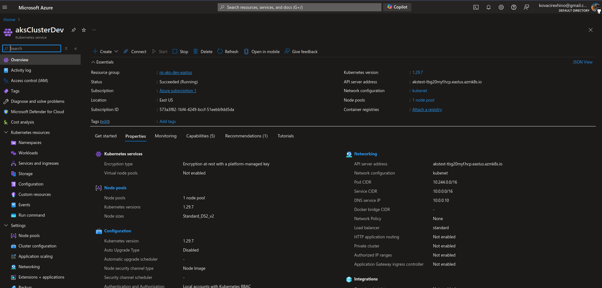
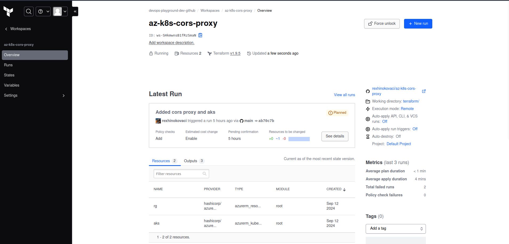
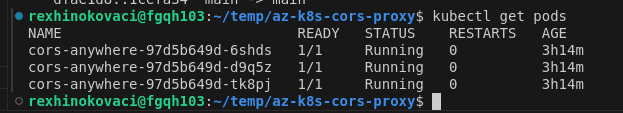
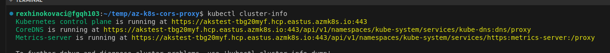
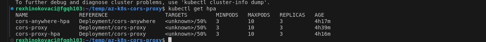
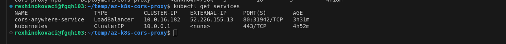
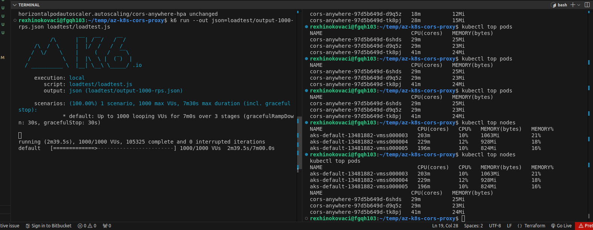
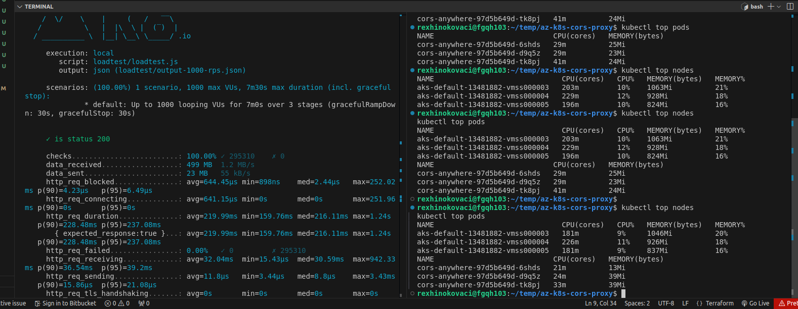
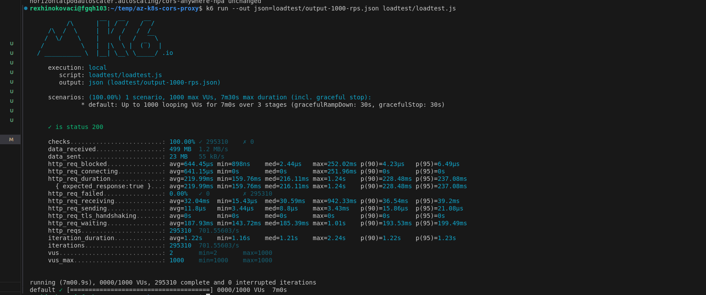

# az-k8s-cors-proxy

A highly available CORS proxy running on **Azure Kubernetes Service (AKS)**, provisioned with **Terraform**, autoscaled with the **Horizontal Pod Autoscaler**, and load-tested with **k6** at up to 1,000 concurrent virtual users.

The proxy itself is the [`redocly/cors-anywhere`](https://hub.docker.com/r/redocly/cors-anywhere) image: it accepts HTTP requests, forwards them to the target URL and adds the CORS headers browsers need.

## Architecture

```
            k6 load test (up to 1000 VUs)
                        │
                        ▼
        Azure LoadBalancer Service (port 80)
                        │
        ┌───────────────┼───────────────┐
        ▼               ▼               ▼
  cors-anywhere   cors-anywhere   cors-anywhere   ← Deployment, 3–10 pods (HPA @ 50% CPU)
     :8080           :8080           :8080
        └──────────── AKS cluster (3 × Standard_DS2_v2) ──┘
                        ▲
              metrics-server (kube-system) feeds the HPA
```

## Tech stack

| Layer | Tooling |
| --- | --- |
| Cloud | Microsoft Azure (resource group + AKS, system-assigned identity) |
| IaC | Terraform with the `azurerm` provider |
| Orchestration | Kubernetes Deployment, LoadBalancer Service, HPA (`autoscaling/v1`) |
| Metrics | metrics-server v0.6.1 |
| Load testing | k6 |

## Repository layout

```
terraform/
  provider.tf     # azurerm provider, auth via service principal variables
  variables.tf    # resource group, location, env, cluster name, node count, credentials
  main.tf         # resource group + AKS cluster (default node pool, DS2_v2 VMs)
  outputs.tf      # kube_config (sensitive), cluster name, resource group name
k8s/
  cors-proxy.yml                 # Deployment (3 replicas) + LoadBalancer Service 80 → 8080
  hpa.yml                        # HPA: min 3, max 10 replicas, target 50% CPU
  metrics-server-deployment.yml  # metrics-server in kube-system
loadtest/
  loadtest.js     # k6 scenario: ramp to 1000 VUs, hold 5 min, ramp down
```

## Getting started

### Prerequisites

- An Azure subscription and a service principal (client ID / secret / tenant ID)
- Terraform, Azure CLI, `kubectl` and [k6](https://k6.io/)

### 1. Provision the cluster

The original runs went through a Terraform Cloud workspace linked to this repository (working directory `terraform/`). Running locally works the same way.


The provider reads credentials from Terraform variables, so pass them via environment variables rather than committing a `.tfvars` file:

```bash
export TF_VAR_client_id=...        TF_VAR_client_secret=...
export TF_VAR_subscription_id=...  TF_VAR_tenant_id=...

cd terraform
terraform init
terraform plan
terraform apply
```

Defaults (overridable in `variables.tf`): resource group `rg-aks-dev-eastus`, location `eastus`, cluster `aksClusterDev`, 3 nodes.

### 2. Connect `kubectl`

```bash
az aks get-credentials \
  --resource-group "$(terraform output -raw resource_group_name)" \
  --name "$(terraform output -raw aks_name)"
```

### 3. Deploy the proxy, metrics-server and autoscaler

```bash
kubectl apply -f k8s/metrics-server-deployment.yml
kubectl apply -f k8s/cors-proxy.yml
kubectl apply -f k8s/hpa.yml
kubectl get service cors-anywhere-service   # note the EXTERNAL-IP
```

### 4. Load test

Set the service's external IP as the `url` in `loadtest/loadtest.js`, then:

```bash
k6 run loadtest/loadtest.js
```

### 5. Tear down

```bash
cd terraform && terraform destroy
```

## Load test results

7-minute run (1 min ramp to 1,000 VUs, 5 min sustained, 1 min ramp down), each VU sending one request per second:

| Metric | Result |
| --- | --- |
| Requests completed | 295,310 |
| Failed requests | **0.00%** (all checks returned HTTP 200) |
| Throughput | ~702 requests/s |
| Latency (median / p95) | 216 ms / 237 ms |

Throughput settled at ~700 RPS, below the 1,000 RPS target. The client script's `sleep(1)` per iteration caps throughput on its own. Pod and node CPU stayed low during the run (see the `kubectl top` screenshot below), so the next steps would be to remove the sleep or raise the VU count, and to scale the HPA on request rate as well as CPU.

## Screenshots

AKS cluster `aksClusterDev` in the Azure portal:



Terraform Cloud workspace connected to this repo (VCS-driven runs, working directory `terraform/`), managing the resource group and AKS cluster:



Proxy pods, autoscaler, service and control plane:






Pod and node resource usage during the load test:




k6 summary:



---

Built by [Rexhino Kovaci](https://github.com/rexhinokovaci) — DevOps & AI engineer in Tirana, Albania. Need an app built? [Get in touch](mailto:kovacirexhino@gmail.com).
